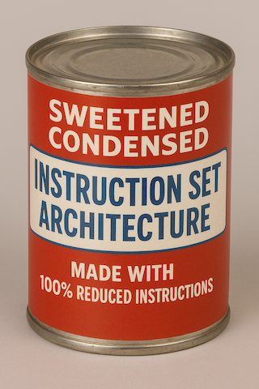

# `scisa`: Sweetened Condensed Instruction Set Architecture

| Mnemonic | Operands     | Description                                  | Opcode    |
| -------- | ------------ | -------------------------------------------- | --------- |
| halt     |              | halt successfully                            | op_halt   |
| inc      | reg          | increment register                           | op_incr   |
| dec      | reg          | decrement register                           | op_decr   |
| neg      | reg          | signed negate                                | op_negr   |
| mov      | reg, imm     | move immediate to register                   | op_movri  |
| mov      | reg, reg     | move register to register                    | op_movrr  |
| add      | reg, imm     | add immediate to register (unsigned)         | op_addri  |
| add      | reg, reg     | add register to register (unsigned)          | op_addrr  |
| sadd     | reg, imm     | add immediate to register (signed)           | op_saddri |
| sadd     | reg, reg     | add register to register (signed)            | op_saddrr |
| sub      | reg, imm     | subtruct immediate from register             | op_subri  |
| sub      | reg, reg     | subtruct register from register              | op_subrr  |
| mul      | reg, imm     | multiply immediate with register             | op_mulri  |
| mul      | reg, reg     | multiply register with register              | op_mulrr  |
| div      | reg, imm     | divide register by immediate (unsigned)      | op_divri  |
| div      | reg, reg     | divide register by register (unsigned)       | op_divrr  |
| sdiv     | reg, imm     | divide register by immediate (signed)        | op_sdivri |
| sdiv     | reg, reg     | divide register by register (signed)         | op_sdivrr |
| mod      | reg, imm     | modulo register by immediate (unsigned)      | op_modri  |
| mod      | reg, reg     | modulo register by register (unsigned)       | op_modrr  |
| smod     | reg, imm     | modulo register by immediate (signed)        | op_smodri |
| smod     | reg, reg     | modulo register by immediate (signed)        | op_smodrr |
| and      | reg, imm     | bitwise AND register with immediate          | op_andri  |
| and      | reg, reg     | bitwise AND register with register           | op_andrr  |
| orr      | reg, imm     | bitwise OR register with immediate           | op_orri   |
| orr      | reg, reg     | bitwise OR register with register            | op_orrr   |
| xor      | reg, imm     | bitwise XOR register with immediate          | op_xorri  |
| xor      | reg, reg     | bitwise XOR register with register           | op_xorrr  |
| lsl      | reg, imm     | logical shift left register by immediate     | op_lslri  |
| lsl      | reg, reg     | logical shift left register by register      | op_lslrr  |
| lsr      | reg, imm     | logical shift right register by immediate    | op_lsrri  |
| lsr      | reg, reg     | logical shift right register by register     | op_lsrrr  |
| asr      | reg, imm     | arithmetic shift right register by immediate | op_asrri  |
| asr      | reg, reg     | arithmetic shift right register by register  | op_asrrr  |
| ldrb     | reg, imm     | load byte from `[imm]` into register         |           |
| ldrb     | reg, reg     | load byte from `[reg]` into register         |           |
| ldrh     | reg, imm     | load halfword from `[imm]` into register     |           |
| ldrh     | reg, reg     | load halfword from `[reg]` into register     |           |
| ldr      | reg, imm     | load word from `[imm]` into register         |           |
| ldr      | reg, reg     | load word from `[reg]` into register         |           |
| strb     | reg, imm     | store byte from register at `[imm]`          |           |
| strb     | reg, reg     | store byte from register at `[reg]`          |           |
| strh     | reg, imm     | store halfword from register at `[imm]`      |           |
| strh     | reg, reg     | store halfword from register at `[reg]`      |           |
| str      | reg, imm     | store word from register at `[imm]`          |           |
| str      | reg, reg     | store word from register at `[reg]`          |           |
| msg      | string, R, * | print operands                               | op_msg    |
| cmp      | imm, reg     | compare immediate with register (signed)     | op_cmpir  |
| cmp      | reg, imm     | compare register with immediate (signed)     | op_cmpri  |
| cmp      | reg, reg     | compare register with register (signed)      | op_cmprr  |
| jmp      | `label`      | jump to `label` unconditionally              | op_jmp    |
| jne      | `label`      | jump to `label` if not equal                 | op_jne    |
| je       | `label`      | jump to `label` if equal                     | op_je     |
| jge      | `label`      | jump to `label` if greater than or equal to  | op_jge    |
| jg       | `label`      | jump to `label` if greater than              | op_jg     |
| jle      | `label`      | jump to `label` if less than or equal to     | op_jle    |
| jl       | `label`      | jump to `label` if less than                 | op_jl     |
| call     | `label`      | call subroutine                              | op_call   |
| ret      |              | return from subroutine                       | op_ret    |

## Notes

ldr / str

ldr <reg> <addr>

ldr r10 0x0000
ldr r11 0x0004
ldr r12 0x0008
ldr r13 0x000c

mov r1, 545454
mov r4, 0x0004
str r4, r1

str r4, 545454

str <reg>
str <addr> <reg>

str <addr> <imm>

ldrri
    ldr <reg>, <imm_addr>
ldrrr
    ldr <reg>, <reg_addr>

strri
    str <reg_addr>, <imm_val>
strrr
    str <reg_addr>, <reg_val>
