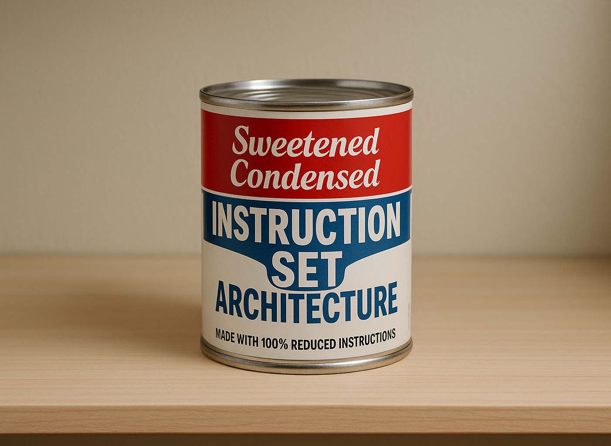

<!-- markdownlint-disable MD024 MD033 MD041 MD045 -->

# `scisa`: Sweetened Condensed Instruction Set Architecture

`scisa` is a losely defined ISA and an assembly interpreter for it.

---

[](etc/scisa.png)

---

## SCISA VM

### Registers

| register   | description               |
| ---------- | ------------------------- |
| `r0`–`r31` | general-purpose registers |
| `pc`       | program counter           |
| `lr`       | link register             |
| `sp`       | stack pointer             |
| `fp`       | frame pointer             |
| `cc`       | 3-way comparison flag     |

### Stack

The stack is 2MB in size, with the top of the stack at `0x7fffffff`.

| size | high address | low address  |
| ---- | ------------ | ------------ |
| 2MB  | `0x7fffffff` | `0x7fdfffff` |

### Data Segment

The data segment is dynamically sized, with a base address of `0x10000000`.

## The SCISA Instruction Set

`scisa` implements a sweet (and condensed) set of instructions. The ISA intends
to be small without being constraining. Instructions are being added as needed.

### Arithmetic and Logic Instructions (Unary)

| Mnemonic | Operands           | Operation                           |
| -------- | ------------------ | ----------------------------------- |
| `add`    | `reg, reg/imm`     | `rd += (unsigned)rs/imm`            |
| `sub`    | `reg, reg/imm`     | `rd -= (unsigned)rs/imm`            |
| `mul`    | `reg, reg/imm`     | `rd *= (unsigned)rs/imm`            |
| `div`    | `reg, reg/imm`     | `rd /= (unsigned)rs/imm`            |
| `sdiv`   | `reg, reg/imm`     | `rd /= (signed)rs/imm`              |
| `mod`    | `reg, reg/imm`     | `rd %= (unsigned)rs/imm`            |
| `smod`   | `reg, reg/imm`     | `rd %= (signed)rs/imm`              |
| `and`    | `reg, reg/imm`     | `(unsigned)rd &= (unsigned)rs/imm`  |
| `or`     | `reg, reg/imm`     | `(unsigned)rd \|= (unsigned)rs/imm` |
| `xor`    | `reg, reg/imm`     | `(unsigned)rd ^= (unsigned)rs/imm`  |
| `lsl`    | `reg, reg/imm`     | `rd <<= (unsigned)rs/imm & mask`    |
| `lsr`    | `reg, reg/imm`     | `rd >>= (unsigned)rs/imm & mask`    |
| `asr`    | `reg, reg/imm`     | `(signed)rd >>= rs/imm & mask`      |
| `inc`    | `reg`              | `rd++`                              |
| `dec`    | `reg`              | `rd--`                              |
| `cmp`    | `reg/imm, reg/imm` | see section on  `cmp`               |

#### Notes

- Shift operations (`lsl`, `lsr`, `asr`) mask of `0x1f`
- The signed modulo instruction (`smod`) uses truncated division, matching the
  behavior of languages like C
- `cmp` *does* allow `imm/imm` comparison

### Control Flow Instructions

| Mnemonic | Operands | Operation                     |
| -------- | -------- | ----------------------------- |
| `jmp`    | `label`  | `pc = &label`                 |
| `jne`    | `label`  | `if (cc & CC_NE) pc = &label` |
| `jeq`    | `label`  | `if (cc & CC_EQ) pc = &label` |
| `jge`    | `label`  | `if (cc & CC_GE) pc = &label` |
| `jgt`    | `label`  | `if (cc & CC_GT) pc = &label` |
| `jle`    | `label`  | `if (cc & CC_LE) pc = &label` |
| `jlt`    | `label`  | `if (cc & CC_LT) pc = &label` |
| `jhs`    | `label`  | `if (cc & CC_HS) pc = &label` |
| `jhi`    | `label`  | `if (cc & CC_HI) pc = &label` |
| `jls`    | `label`  | `if (cc & CC_LS) pc = &label` |
| `jlo`    | `label`  | `if (cc & CC_LO) pc = &label` |
| `call`   | `label`  | `lr = pc; pc = &label`        |
| `ret`    |          | `pc = lr`                     |
| `halt`   |          | `halt successfully`           |

#### Notes

- All programs must end with a halt instruction

### Data Handling and Memory Instructions

| Mnemonic | Operands                    | Operation                              |
| -------- | --------------------------- | -------------------------------------- |
| `mov`    | `reg, reg/imm`              | `rd = rs/imm`                          |
| `movne`  | `reg, reg/imm`              | `if (cc & CC_NE) rd = rs/imm`          |
| `moveq`  | `reg, reg/imm`              | `if (cc & CC_EQ) rd = rs/imm`          |
| `movge`  | `reg, reg/imm`              | `if (cc & CC_GE) rd = rs/imm`          |
| `movgt`  | `reg, reg/imm`              | `if (cc & CC_GT) rd = rs/imm`          |
| `movle`  | `reg, reg/imm`              | `if (cc & CC_LE) rd = rs/imm`          |
| `movlt`  | `reg, reg/imm`              | `if (cc & CC_LT) rd = rs/imm`          |
| `movhs`  | `reg, reg/imm`              | `if (cc & CC_HS) rd = rs/imm`          |
| `movhi`  | `reg, reg/imm`              | `if (cc & CC_HI) rd = rs/imm`          |
| `movls`  | `reg, reg/imm`              | `if (cc & CC_LS) rd = rs/imm`          |
| `movlo`  | `reg, reg/imm`              | `if (cc & CC_LO) rd = rs/imm`          |
| `push`   | `reg`                       | `sp -= 4; *sp = rs`                    |
| `pop`    | `reg`                       | `rd = *sp; sp += 4`                    |
| `ldsb`   | `reg, reg/imm/imm(reg)`     | `rd = sext(*(i8 *)rs/imm/(imm + rs))`  |
| `ldsh`   | `reg, reg/imm/imm(reg)`     | `rd = sext(*(i16 *)rs/imm/(imm + rs))` |
| `ldub`   | `reg, reg/imm/imm(reg)`     | `rd = zext(*(u8 *)rs/imm/(imm + rs))`  |
| `lduh`   | `reg, reg/imm/imm(reg)`     | `rd = zext(*(u16 *)rs/imm/(imm + rs))` |
| `ldw`    | `reg, reg/imm/imm(reg)`     | `rd = *rs/*imm/*(imm + rs)`            |
| `str`    | `reg/imm, reg/imm/imm(reg)` | `*rd/*imm/*(imm + rd) = rs/imm`        |
| `lea`    | `reg, label/imm(label)`     | `rd = &label/(&label + imm)`           |

#### Notes

- The first operand of `ldr` is the **destination** register (`rd`). Regardless
  of whether the second operand is an immediate value, a register, or an
  immediate offset from a register, the resulting value is interpreted as the
  load *address*.
- The first operand of `str` is the **source** register (`rs`). Like `ldr`, it
  does not matter whether the second operand is an immediate value, a register,
  or an immediate offset from a register, the resulting value is interpreted as
  the store *address*.

### String and Output Instructions

| Mnemonic | Operands         | Operation                                |
| -------- | ---------------- | ---------------------------------------- |
| `msg`    | `string, reg, *` | print arguments to stdout                |
| `out`    | `reg, reg/imm`   | write `rs/imm` bytes from `rd` to stdout |

## Syntax

All mnemonics can be uppercase or lowercase:

```asm
add r1, r2
```

and

```asm
ADD r1, r2
```

are equivalent. Similarly, all registers can be uppercase or lowercase:

```asm
mul r1, r2
```

and

```asm
mul R1, R2
```

are equivalent.

---

Immediate values can be specified in decimal or hexadecimal format. Hexadecimal
values are prefixed with `0x` and are case-insensitive.

```asm
mov r4, 0x1000
mov r5, 0xFFFF
mov r6, 0xffff
```

Decimal values are specified without a prefix.

```asm
mov r5, 4096
```

Both decimal and hexadecimal values can be specified with a sign.

```asm
mov r6, -0x1000
mov r7, +0x1000 ; silly but valid
mov r8, -4096
mov r9, +4096   ; ditto
```

---

### `op reg, reg/imm`

```asm
add r1, r2
sub r3, 50
```

### `op reg, reg/imm/imm(reg)`

```asm
mov r5, sp
ldr r4, r5 ; *r5 = r4
```

```asm
mov r5, 0x10000000
ldr r4, r5 ; r4 = *0x10000000
```

```asm
ldr r4, 0x10000000 ; r4 = *0x10000000
```

```asm
mov r5, 0x10000000
add r5, 16
ldr r4, r5
```

is identical to

```asm
mov r5, 0x10000000
ldr r4, 16(r5)
```

### `op reg`

#### ALU & Logic Instructions

```asm
inc r4 ; r4 = r4 + 1
dec r5 ; r5 = r5 - 1
```

#### Stack Instructions

```asm
push r4 ; sp -= 4
        ; str r4, sp

pop r5  ; ldr r5, sp
        ; sp += 4
```

### `cmp`

`cmp` uses the following symantics to set the `cc` register:

```c
uint32_t setcc(uint32_t u0, uint32_t u1)
{
    int32_t i0 = u0;
    int32_t i1 = u1;
    uint32_t r = CC_NULL;
    r |= (u0 != u1) ? CC_NE : CC_NULL;
    r |= (u0 == u1) ? CC_EQ : CC_NULL;
    r |= (i0 >= i1) ? CC_GE : CC_NULL;
    r |= (i0  > i1) ? CC_GT : CC_NULL;
    r |= (i0 <= i1) ? CC_LE : CC_NULL;
    r |= (i0  < i1) ? CC_LT : CC_NULL;
    r |= (u0 >= u1) ? CC_HS : CC_NULL;
    r |= (u0  > u1) ? CC_HI : CC_NULL;
    r |= (u0 <= u1) ? CC_LS : CC_NULL;
    r |= (u0  < u1) ? CC_LO : CC_NULL;
    return r;
}
```

### Directives

`scisa` implements assembler directives for specifying segments and creating
initialized data.

| segment directive | description                |
| ----------------- | -------------------------- |
| `.text`           | mark start of text segment |
| `.data`           | mark start of data segment |

Use `.text` and `.data` to switch back and forth between segments as needed.

> Although usage of the data segment is optional, there is no default segment.
> If a program contains instructions, it must also contain a `.text` directive
> (and a halt instruction)

| data directive | syntax       | description               | notes                  |
| -------------- | ------------ | ------------------------- | ---------------------- |
| .word          | `.word imm`  | create a 4-byte value     |                        |
| .byte          | `.byte imm`  | create a 1-byte value     | keeps lower byte `imm` |
| .zero          | `.zero imm`  | emit `imm` zeros          |                        |
| .align         | `.align imm` | align data to `imm` bytes |                        |

### Assembly Syntax

#### `reg, reg/imm`

Most instructions use the `reg, reg/imm` syntax.

```asm
add r1, r2
sub r3, 50
```

---

#### `reg, reg/imm/imm(reg)`

Load and store instructions support a `reg, reg/imm/imm(reg)` syntax.

```asm
ldr r18, 48(sp)
...
...
str r18, 0x30(sp)
```

---

#### `reg, label/imm(label)`

The `LEA` instruction supports `reg, label/imm(label)` syntax.

```asm
.data
consts:
    .word   2146121005
    .word   -2073254261
    .word   1124208931
    .word   493478565

.text
hash:
    ...
    ...
    ; x *= consts[2]
    lea r2, 8(consts)
    ldr r3, r2
    mul r4, r3
    ...
    ...
    ; x *= consts[3]
    lea r2, 12(consts)
    ldr r3, r2
    mul r4, r3
    ...
    ...
```

Alternatively, keep the base label address on hand and apply an offset at load:

```asm
hash:
    lea r2, consts
    ...
    ...
    ; x *= consts[2]
    ldr r3, 8(r2)
    mul r4, r3
    ...
    ...
    ; x *= consts[3]
    ldr r3, 12(r2)
    mul r4, r3
    ...
    ...
```

---

#### `msg` Syntax

`msg` accepts a variable number of comma-seperated arguments. Arguments can be
any combination of single-quoted strings and registers.

```asm
msg     'ackermann(', r4, ', ', r5, ') = ', r6, '\n'
```

`msg` buffers up to 64 bytes before flushing to stdout. A `msg` can be flushed
explicitly using a NUL byte.

```asm
msg     '\r', r4, '\t', r5, '\0'
```

## TODO

Let PUSH and POP accept a variable number of register operands

```u
-fverbose-asm
-Os
-mips1
-mgp32
-msym32
-mlong32
-fno-delayed-branch
-mcompact-branches=never
-mno-micromips
-mno-mt
-mno-eva
-mno-mcu
-mno-virt
-mno-xpa
-mno-crc
-mno-mad
-mno-dsp
-mno-madd4
-mno-imadd
-mno-llsc
-mno-lxc1-sxc1
-mno-memcpy
-msoft-float
-mno-split-addresses
-mno-load-store-pairs
-mno-check-zero-division
-mframe-header-opt
```
